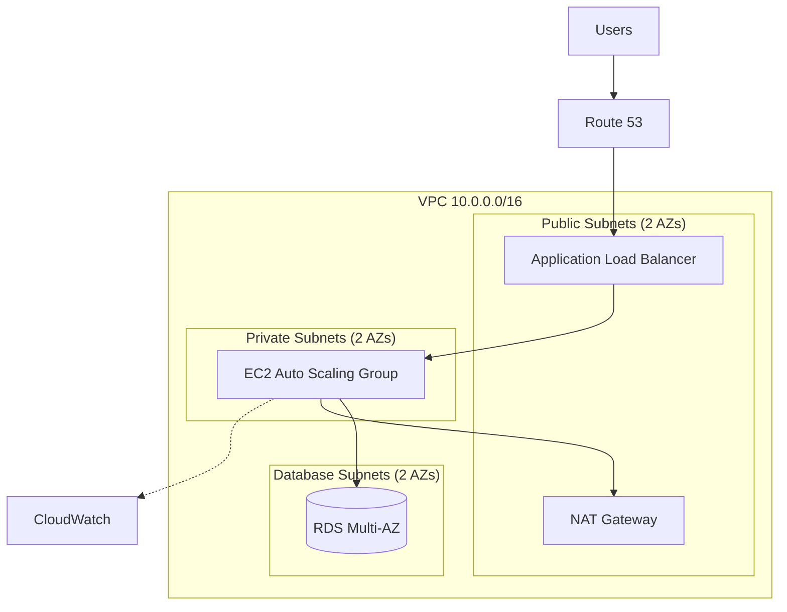

<h1 align="center">☁️ AWS Multi-Tier Infrastructure with Terraform</h1>

<p align="center">
  Production-grade, secure, and scalable AWS infrastructure provisioned using reusable Terraform modules.
</p>

<p align="center">
  
  
  
  
</p>

---

## 📌 Overview

This project provisions a highly available, three-tier web architecture on AWS using Infrastructure as Code (IaC). It follows AWS Well-Architected best practices for security, reliability, and cost optimization.

**Problem solved:** Manual infrastructure setup is slow, inconsistent, and error-prone.
**Solution:** Fully automated, repeatable, and version-controlled deployments with Terraform.

---

## 🏗️ Architecture



> 📷 Add an exported diagram image here as well (draw.io or Lucidchart): `docs/architecture.png`

---

## ✨ Features

- ✅ Custom VPC with public, private, and database subnets across 2 Availability Zones
- ✅ Application Load Balancer with health checks
- ✅ EC2 Auto Scaling Group with scaling policies
- ✅ RDS (Multi-AZ) in isolated private subnets
- ✅ Remote state in S3 with DynamoDB state locking
- ✅ Least-privilege IAM roles and security groups
- ✅ CloudWatch alarms and logging
- ✅ CI/CD with GitHub Actions (`fmt`, `validate`, `tfsec`, `plan`)

---

## 🧰 Tech Stack

| Category | Tools |
|----------|-------|
| Cloud | AWS (VPC, EC2, ALB, ASG, RDS, S3, IAM, CloudWatch) |
| IaC | Terraform |
| CI/CD | GitHub Actions |
| Security | tfsec, Checkov, IAM, Security Groups |
| Monitoring | CloudWatch |

---

## 📁 Project Structure

```
.
├── modules/
│   ├── vpc/
│   ├── alb/
│   ├── asg/
│   └── rds/
├── environments/
│   ├── dev/
│   └── prod/
├── docs/
│   └── architecture.png
├── .github/
│   └── workflows/
│       └── terraform.yml
├── .gitignore
└── README.md
```

---

## ⚙️ Prerequisites

- AWS account with programmatic access
- [Terraform](https://developer.hashicorp.com/terraform/downloads) >= 1.5
- [AWS CLI](https://aws.amazon.com/cli/) configured (`aws configure`)
- S3 bucket and DynamoDB table for remote state

---

## 🚀 Deployment

```bash
# 1. Clone the repository
git clone https://github.com/<username>/<repo-name>.git
cd <repo-name>/environments/dev

# 2. Initialize Terraform
terraform init

# 3. Validate and preview changes
terraform validate
terraform plan -out=tfplan

# 4. Apply
terraform apply tfplan
```

**Output:** After a successful apply, Terraform prints the ALB DNS name. Open it in your browser to test.

---

## 🔐 Security Practices

- No credentials or secrets committed (`.gitignore` excludes `*.tfstate`, `*.tfvars`)
- Secrets stored in AWS Secrets Manager
- Encrypted S3 state bucket and RDS storage
- Private subnets for application and database tiers
- Security groups follow least privilege
- Automated scanning with tfsec in the CI pipeline

---

## 💰 Cost Estimate

| Resource | Approx. Monthly Cost (USD) |
|----------|----------------------------|
| NAT Gateway | ~$32 |
| ALB | ~$18 |
| EC2 (2 x t3.micro) | ~$15 |
| RDS (db.t3.micro, Multi-AZ) | ~$30 |

> ⚠️ Estimates only. Check the AWS Pricing Calculator for current prices. Destroy resources after testing.

---

## 🧹 Cleanup

```bash
terraform destroy
```

---

## 📸 Screenshots

| Deployed Application | CloudWatch Dashboard |
|---|---|
|  |  |

---

## 📚 What I Learned

- Designing reusable, modular Terraform code
- Managing remote state and locking safely
- Building secure multi-AZ network architecture
- Integrating security scanning into CI/CD pipelines

---

## 🔮 Future Improvements

- [ ] Add HTTPS with ACM certificate
- [ ] Add WAF in front of the ALB
- [ ] Migrate to EKS with ArgoCD
- [ ] Add cost monitoring with AWS Budgets

---

## 👩‍💻 Author

**Shilpa Khamaru**
AWS Cloud & DevOps Engineer

[](https://linkedin.com/in/<your-username>)
[](https://github.com/<your-username>)

---

⭐ If you found this project useful, please give it a star!
